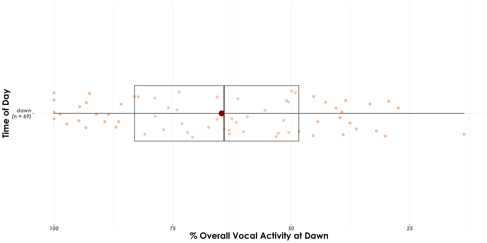

# Vocal activity

In this script, we examine differences in vocal activity between dawn and dusk for each species. 

## Install necessary libraries
```{r}
library(tidyverse)
library(dplyr)
library(stringr)
library(vegan)
library(ggplot2)
library(scico)
library(data.table)
library(extrafont)
library(ggstatsplot)
library(rstatix)
```

## Load acoustic data and species scientific names data
```{r}
acoustic_data <- read.csv("results/acoustic_data.csv")
species_codes <- read.csv("data/species-annotation-codes.csv")
```

## Vocal activity across time periods

A number of factors need to be considered in further analysis: accounting for time_of_day, observed_identity for example. However, we run analyses that account for differences in calling activity by species for dawn and dusk.

```{r}
# sampling effort by time_of_day
effort <- acoustic_data %>%
    dplyr::select(site_id, date, time_of_day) %>%
    distinct() %>%
    arrange(time_of_day) %>%
    count(time_of_day) %>%
    rename(., nVisits = n)

# Above, we note that we had sampled ~293 site-date combinations at dawn, while ~245 site-date combinations were sampled at dusk

# total number of acoustic detections summarized across every 10-s audio file
# here, we estimate % detections at dawn and dusk, while accounting for sampling effort
vocal_act <- acoustic_data %>%
  group_by(time_of_day, eBird_codes) %>%
  summarise(detections = sum(number)) %>%
  left_join(., species_codes[,c(1,2,5)], 
                       by = "eBird_codes") %>%
   group_by(eBird_codes) %>%
  mutate(total_detections =sum(detections)) %>%
  mutate(percent_detections = (detections/total_detections)*100) %>%
  ungroup() 

## accouting for sampling effort and normalizing data
vocal_act <- vocal_act %>%
  left_join(., effort, by = "time_of_day") %>%
  mutate(normalized_detections = detections/nVisits) %>%
  group_by(eBird_codes) %>%
  mutate(total_normalized_detections = sum(normalized_detections)) %>%
  mutate(percent_normalized_detections = (normalized_detections/total_normalized_detections)*100) %>%
  ungroup() %>%

# in our case, we have 3 species which have 100% detections in dawn, Indian blackbird, Little spiderhunter and Purple sunbird. For these, we add a additional row specifying no detections in dusk.
  
  add_row(time_of_day= 'dusk', eBird_codes = 'pursun4', detections = 0, scientific_name = 'Cinnyris asiaticus', common_name = 'Purple Sunbird', total_detections = 315, percent_detections = 0, normalized_detections = 0,
          percent_normalized_detections = 0, nVisits = 245, total_normalized_detections = 1.075085) %>%
  add_row(time_of_day= 'dusk', eBird_codes = 'eurbla2', detections = 0, scientific_name = 'Turdus simillimus', common_name = 'Indian Blackbird', total_detections = 236, percent_detections = 0,normalized_detections = 0,
          percent_normalized_detections = 0, nVisits = 245,
          total_normalized_detections = 0.8054608) %>%
  add_row(time_of_day= 'dusk', eBird_codes = 'litspi1', detections = 0, scientific_name = 'Arachnothera longirostra', common_name = 'Little Spiderhunter', total_detections = 417, percent_detections = 0,
          normalized_detections = 0, nVisits = 245, 
          percent_normalized_detections = 0,
          total_normalized_detections = 1.423208)

# for the sake of plotting, we will create a new variable 
vocal_act$plot_percent <- ifelse(vocal_act$time_of_day == "dawn",
                                 -1*vocal_act$percent_normalized_detections,
                                 vocal_act$percent_normalized_detections)

# figure of percent detections
fig_percent_detections <- ggplot(vocal_act, aes(
            x = reorder(common_name, desc(common_name)),
                               y = plot_percent,
                               fill = time_of_day)) +
  geom_text(aes(label=signif(abs(plot_percent),3)),
            hjust = ifelse(vocal_act$plot_percent >= 0, 0, 1),
            size = 3) +
  geom_bar(stat = "identity") +
  scale_fill_manual(values = c("#d95f02","#1b9e77")) +
  scale_y_continuous(labels=abs) +
  coord_flip() +
  labs(y = '% Vocal activity (at dawn and at dusk)',
       x = 'Species common name') +
  theme_bw() +
  theme(text = element_text(family = "Century Gothic", size = 10, face = "bold"),plot.title = element_text(family = "Century Gothic",
      size = 15, face = "bold"),
      plot.subtitle = element_text(family = "Century Gothic", 
      size = 15, face = "bold",color="#1b2838"),
      axis.title = element_text(family = "Century Gothic",
      size = 15, face = "bold"))

ggsave(fig_percent_detections, filename = "figs/fig_percentDetections_species.png", width = 14, height = 16, device = png(), units = "in", dpi = 300)
dev.off() 
```

  

## Is overall vocal activity much higher at dawn compared to dusk, across species?

```{r}
fig_overall_vocal_act <- vocal_act %>%
  ggbetweenstats(x = time_of_day,
                         y = percent_normalized_detections,
                         xlab = "Time of Day",
                         ylab = "% Vocal activity", 
                         pairwise.display = "significant",
                         package = "ggsci",
                         palette = "default_jco",
                         violin.args = list(width = 0),
ggplot.component = list(theme(text = element_text(family = "Century Gothic", size = 15, face = "bold"),plot.title = element_text(family = "Century Gothic",
      size = 18, face = "bold"),
      plot.subtitle = element_text(family = "Century Gothic", 
      size = 15, face = "bold",color="#1b2838"),
      axis.title = element_text(family = "Century Gothic",
      size = 15, face = "bold")))) 

ggsave(fig_overall_vocal_act, filename = "figs/fig_percentDetections_overall.png", width = 14, height = 16, device = png(), units = "in", dpi = 300)
dev.off() 
```

Overall, higher vocal activity was detected at dawn compared to dusk, across species.


## Testing for differences in acoustic detections between dawn and dusk

Here, we see whether there are differences in the acoustic detections for each species between dawn and dusk. 
```{r}
stat.test <- vocal_act %>%  
  pairwise_wilcox_test(detections ~ time_of_day)

# We observe significant differences in acoustic detections across species between dawn and dusk

# A tibble: 1 × 9
#  .y.        group1 group2    n1    n2 statistic        p    p.adj p.adj.signif
# <chr>      <chr>  <chr>  <int> <int>     <dbl>    <dbl>    <dbl> <chr>       
# detections dawn   dusk      69    69     3192. 0.000549 0.000549 ***  
```
