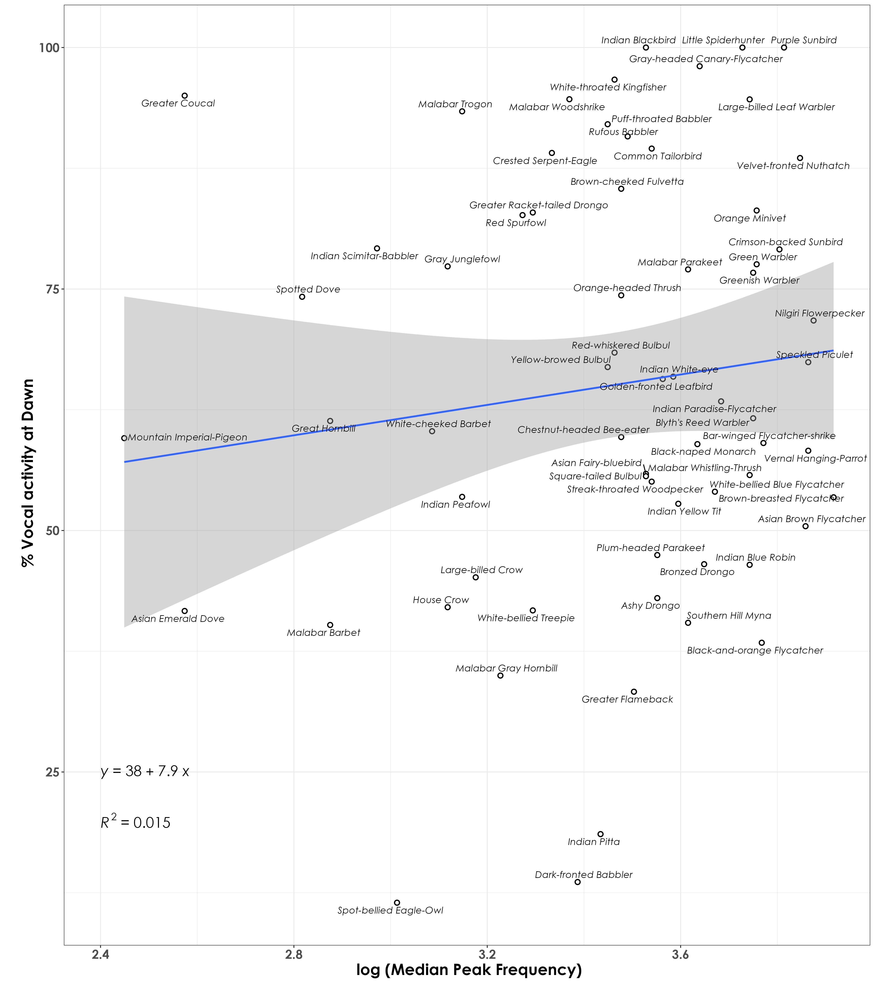

# Frequency

In this script, we examine differences in vocal activity between dawn and dusk for each species as a function of frequency. The expectation is that higher frequency vocalizers would call more at dawn compared to dusk, owing to better signal transmission in the morning.

## Install necessary libraries
```{r}
library(tidyverse)
library(dplyr)
library(stringr)
library(vegan)
library(ggplot2)
library(scico)
library(data.table)
library(extrafont)
library(ggstatsplot)
library(ggpubr)
library(ggrepel)
```

## Load acoustic data and species scientific names data
```{r}
acoustic_data <- read.csv("results/acoustic_data.csv")
species_codes <- read.csv("data/species-annotation-codes.csv")
freq <- read.csv("data/frequency-data.csv")
```

## Vocal activity data
```{r}
# total number of acoustic detections summarized across every 10-s audio file
vocal_act <- acoustic_data %>%
  group_by(time_of_day, eBird_codes) %>%
  summarise(detections = sum(number)) %>%
  left_join(., species_codes[,c(1,2,5)], 
                       by = "eBird_codes") %>%
   group_by(eBird_codes) %>%
  mutate(total_detections =sum(detections)) %>%
  mutate(percent_detections = (detections/total_detections)*100) %>%
  ungroup()

# for further analysis, we remove species that were detected less than 20 times cumulatively across dawn and dusk
# this ensures that we keep species that called very few times in the morning and perhaps more times in the evening, or vice-versa

vocal_act <- vocal_act %>%
  filter(total_detections > 20) 
```

## Frequency data

We will extract the median peak frequency for each species. Note: For a total of 114 species, template recordings (varying from a minimum of 2 templates to 1910 templates per species) was extracted by Meghana P Srivathsa. While extracting median peak frequency, no distinction was made between songs and calls. We removed species that had very few templates (we only kept species that had a minimum of 10 frequency related measures).

```{r}
# add standardized eBird codes to the frequency data
freq <-left_join (freq, species_codes[c(3,5)],
                  by = "species_annotation_codes")

# Only a total of 99 species are left after filtering species with very few templates
nTemplates_5 <- freq %>%
  group_by(eBird_codes) %>%
  count() %>%
  filter(n >= 5)

# left-join to remove species with less than 10 templates in the frequency dataset
freq_5 <- left_join(nTemplates_5[,1], freq)

# calculate median peak frequency
median_pf <- freq_5 %>%
  group_by(eBird_codes) %>%
  summarise(median_peak_freq =  median(peak_freq_in_Hz))

## join the frequency data to the vocal activity data
voc_freq <- left_join(vocal_act, median_pf, by = "eBird_codes") %>%
  drop_na()

# A total of 92 species were included and eight species were excluded.
```

## Visualization of % detections vs. median peak frequency

Here, we model the % of detections at dawn as a function of median peak frequency.  

```{r}
# we will filter the data to only include dawn
dawn <- voc_freq %>%
  filter(time_of_day == "dawn") %>%
  filter(eBird_codes != "pabflo1")

# the only species that was excluded above was pied bushchat, which was reported only from dusk

fig_freq_vocAct <- ggplot(dawn, aes(x=median_peak_freq,
                                        y= percent_detections)) +
  geom_point(shape = 21, colour = "black", 
             fill = "white", size = 2, stroke = 1)+ 
  geom_smooth(method="lm", se=TRUE, fullrange=FALSE, level=0.95,linetype="solid") +  
  theme_bw() +
  stat_regline_equation(label.x = 6000, aes(label = ..eq.label..),
                        label.y = 10, size = 8) +
  stat_regline_equation(label.x = 4000, aes(label = ..rr.label..),
                        label.y = 10,
                        size = 8) +
  labs(y="\n % acoustic detections at dawn", 
       x="Median Peak Frequency\n") +
  geom_text_repel(aes(label = common_name), family = "Century Gothic",
                  fontface = "italic") +
  theme(text = element_text(family = "Century Gothic", size = 18, face = "bold"),plot.title = element_text(family = "Century Gothic",
      size = 18, face = "bold"),
      plot.subtitle = element_text(family = "Century Gothic", 
      size = 15, face = "bold",color="#1b2838"),
      axis.title = element_text(family = "Century Gothic",
      size = 18, face = "bold"))

ggsave(fig_freq_vocAct, filename = "figs/fig_peakFrequency_vs_dawnDetections.png", width = 14, height = 16, device = png(), units = "in", dpi = 300)
dev.off() 

```

 


