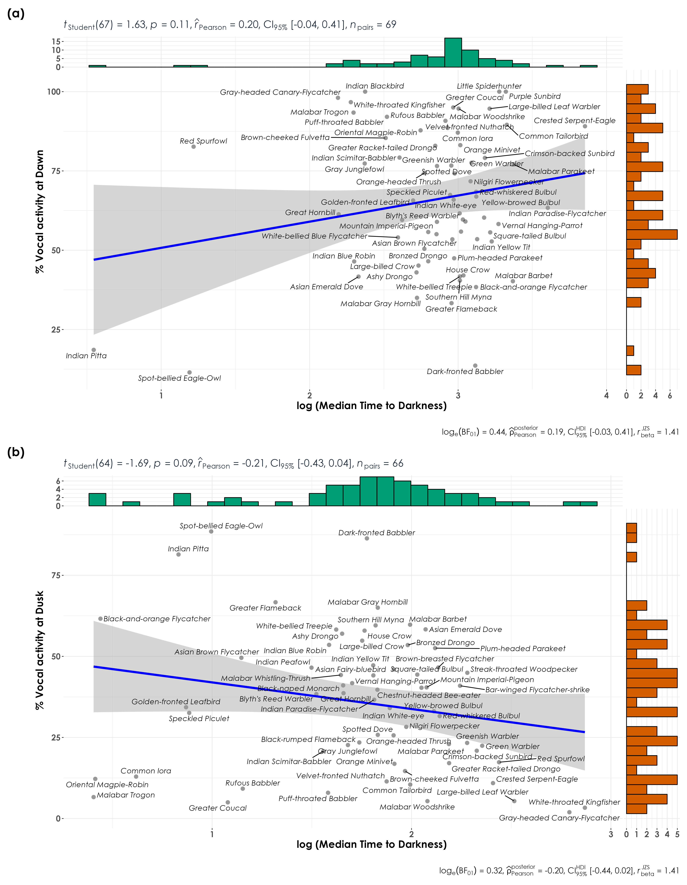

# Light availability

In this script, we examine differences in vocal activity between dawn and dusk as a function of light availability. The expectation is that species would call much earlier in the day, closer to sunrise compared to later in the day when one could spend time foraging.  

## Install necessary libraries
```{r}
library(tidyverse)
library(dplyr)
library(stringr)
library(vegan)
library(ggplot2)
library(scico)
library(data.table)
library(extrafont)
library(ggstatsplot)
library(suncalc)
library(lutz)
library(stringr)
library(ggpmisc)
library(ggpubr)
library(hms)
library(RColorBrewer)
```

## Load acoustic data and species scientific names data
```{r}
acoustic_data <- read.csv("results/acoustic_data.csv")
sites <- read.csv("data/list-of-sites.csv")
species_codes <- read.csv("data/species-annotation-codes.csv")
```

## Vocal Activity

We use normalized percent detections (percent detections which account for sampling effort) as a response variable in our PGLS analysis.
```{r}
# sampling effort by time_of_day
effort <- acoustic_data %>%
  dplyr::select(site_id, date, time_of_day) %>%
  distinct() %>%
  arrange(time_of_day) %>%
  count(time_of_day) %>%
  rename(., nVisits = n)

# Above, we note that we had sampled ~293 site-date combinations at dawn, while ~245 site-date combinations were sampled at dusk

# total number of acoustic detections summarized across every 10-s audio file
# here, we estimate % detections at dawn and dusk, while accounting for sampling effort
vocal_act <- acoustic_data %>%
  group_by(time_of_day, eBird_codes) %>%
  summarise(detections = sum(number)) %>%
  left_join(., species_codes[, c(1, 2, 5)],
    by = "eBird_codes"
  ) %>%
  group_by(eBird_codes) %>%
  mutate(total_detections = sum(detections)) %>%
  mutate(percent_detections = (detections / total_detections) * 100) %>%
  ungroup()

## accouting for sampling effort and normalizing data
vocal_act <- vocal_act %>%
  left_join(., effort, by = "time_of_day") %>%
  mutate(normalized_detections = detections / nVisits) %>%
  group_by(eBird_codes) %>%
  mutate(total_normalized_detections = sum(normalized_detections)) %>%
  mutate(percent_normalized_detections = (normalized_detections / total_normalized_detections) * 100) %>%
  ungroup()
```

## Extract light availability for each date
```{r}
# add longitude and latitude to acoustic_data
acoustic_data <- left_join(acoustic_data, sites[, c(2, 4, 5)],
  by = "site_id"
)
acoustic_data$date <- lubridate::ymd(acoustic_data$date)
names(acoustic_data)[c(10, 11)] <- c("lon", "lat")

# find out what time zone needs to be provided for the sunlight calculations
acoustic_data$tz <- tz_lookup_coords(
  lat = acoustic_data$lat,
  lon = acoustic_data$lon,
  method = "accurate",
  warn = FALSE
)

# extract nauticalDawn, nauticalDusk, sunrise and sunset times
light_data <- getSunlightTimes(
  data = acoustic_data,
  keep = c(
    "sunrise", "sunset",
    "nauticalDawn", "nauticalDusk"
  ),
  tz = "Asia/Kolkata"
) %>% distinct(.)

# strip dates from new columms and keep only time
light_data$sunrise <- as_hms(light_data$sunrise)
light_data$sunset <- as_hms(light_data$sunset)
light_data$nauticalDawn <- as_hms(light_data$nauticalDawn)
light_data$nauticalDusk <- as_hms(light_data$nauticalDusk)

# format the start_time column in the acoustic data to keep it as the same format as light_data
acoustic_data <- acoustic_data %>%
  mutate(across(start_time, str_pad, width = 6, pad = "0"))
acoustic_data$start_time <- format(strptime(acoustic_data$start_time,
  format = "%H%M%S"
), format = "%H:%M:%S")
acoustic_data$start_time <- as_hms(acoustic_data$start_time)

# summarize detections of species for every 15-min window
acoustic_data <- acoustic_data %>%
  group_by(
    site_id, date, start_time, time_of_day, eBird_codes,
    lon, lat, hour_of_day
  ) %>%
  summarise(detections = sum(number)) %>%
  ungroup()

# join the two datasets
acoustic_data <- left_join(acoustic_data, light_data,
  by = c("date", "lon", "lat")
)

# subtract times from sunrise, sunset, nauticalDawn and nauticalDusk from start_time of acoustic detections
acoustic_data <- acoustic_data %>%
  mutate(time_from_dawn = as.numeric((start_time - nauticalDawn),
    units = "hours"
  )) %>%
  mutate(time_from_sunrise = as.numeric((start_time - sunrise),
    units = "hours"
  )) %>%
  mutate(time_to_dusk = as.numeric((nauticalDusk - start_time),
    units = "hours"
  )) %>%
  mutate(time_to_sunset = as.numeric((sunset - start_time),
    units = "hours"
  ))
```

## Model acoustic detections as a function of light availability  

Here, we choose times of day as proxies for light availability (ie. nautical dawn, dusk for example).  

```{r}
# Here, we make the assumption that light levels are fairly similar closer to dawn and closer to dusk. Hence, we model the number of acoustic detections as a function of time to dusk and time from dawn.

# add species_codes/common_name to the above dataset
acoustic_data <- acoustic_data %>%
  left_join(., species_codes[, c(1, 2, 5)],
    by = "eBird_codes"
  ) %>%
  ungroup()

# visualization
plots <- list()

# collect slope and other coefficient information here
metadata <- c()

for (i in 1:length(unique(acoustic_data$common_name))) {
  # extract species common_name
  a <- unique(acoustic_data$common_name)[i]

  # subset data for plotting
  sp <- acoustic_data[acoustic_data$common_name == a, ]

  # bind dawn and dusk data together
  dawn <- sp %>%
    filter(time_of_day == "dawn") %>%
    dplyr::select(detections, time_from_dawn, time_of_day) %>%
    rename(., time_from_startTime = time_from_dawn)

  dusk <- sp %>%
    filter(time_of_day == "dusk") %>%
    dplyr::select(detections, time_to_dusk, time_of_day) %>%
    rename(., time_from_startTime = time_to_dusk)

  data <- bind_rows(dawn, dusk)

  p <- grouped_ggscatterstats(data,
    x = time_from_startTime,
    y = detections,
    ylab = "\n Number of acoustic detections",
    xlab = "Time to darkness\n",
    grouping.var = time_of_day,
    annotation.args = list(title = a),
    plotgrid.args = list(nrow = 2, ncol = 1),
    ggplot.component = list(theme(
      text = element_text(family = "Century Gothic", size = 15, face = "bold"), plot.title = element_text(
        family = "Century Gothic",
        size = 18, face = "bold"
      ),
      plot.subtitle = element_text(
        family = "Century Gothic",
        size = 15, face = "bold", color = "#1b2838"
      ),
      axis.title = element_text(
        family = "Century Gothic",
        size = 15, face = "bold"
      )
    ))
  )

  ## save plot object
  plots[[i]] <- p

  # extract_stats
  dawn_metadata <- extract_stats(p[[1L]])
  if (is.null(dawn_metadata$subtitle_data) == FALSE) {
    dawn_metadata <- dawn_metadata$subtitle_data %>%
      mutate(common_name = a) %>%
      mutate(time_of_day = "dawn")
  }

  dusk_metadata <- extract_stats(p[[2L]])
  if (is.null(dusk_metadata$subtitle_data) == FALSE) {
    dusk_metadata <- dusk_metadata$subtitle_data %>%
      mutate(common_name = a) %>%
      mutate(time_of_day = "dusk")
  }

  ## add the above to the metadata object
  metadata <- bind_rows(
    metadata, dawn_metadata,
    dusk_metadata
  )
}

# save as a single pdf
cairo_pdf(
  filename = "figs/acoustic-detections-time-to-darkness.pdf",
  width = 13, height = 12,
  onefile = TRUE
)
plots
dev.off()

# write metadata to file
metadata <- apply(metadata, 2, as.character)
write.csv(data.frame(metadata), "results/metadata-detections-lightAvailability-correlations.csv", row.names = F)
```

## Visualization of timing of vocalization 

```{r}
# sampling effort by hour_of_day
effort <- acoustic_data %>%
  dplyr::select(site_id, date, hour_of_day) %>%
  distinct() %>%
  arrange(hour_of_day) %>%
  count(hour_of_day) %>%
  rename(., nVisits = n)

# visualization
plots <- list()

for (i in 1:length(unique(acoustic_data$common_name))) {
  # extract species common_name
  a <- unique(acoustic_data$common_name)[i]

  # subset data for plotting
  sp <- acoustic_data[acoustic_data$common_name == a, ] %>%
    group_by(hour_of_day) %>%
    summarise(detections = sum(detections)) %>%
    mutate(total_detections = sum(detections)) %>%
    ungroup()

  # normalize for sampling effort
  sp <- left_join(sp, effort, by = "hour_of_day") %>%
    mutate(normalized_detections = (detections / nVisits)) %>%
    mutate(total_normalized_detections = sum(normalized_detections)) %>%
    mutate(percent_normalized_detections = (normalized_detections / total_normalized_detections) * 100) %>%
    ungroup()

  # add a break/no data for mid-day
  sp <- sp %>%
    add_row(
      hour_of_day = "Mid-day",
      nVisits = 0,
      detections = 0,
      total_detections = 0,
      normalized_detections = 0,
      total_normalized_detections = 0,
      percent_normalized_detections = 0
    )

  # reordering factors for plotting
  sp$hour_of_day <- factor(sp$hour_of_day, levels = c(
    "6AM to 7AM",
    "7AM to 8AM",
    "8AM to 9AM",
    "9AM to 10AM",
    "Mid-day",
    "4PM to 5PM",
    "5PM to 6PM",
    "6PM to 7PM"
  ))

  plots[[i]] <- ggplot(sp, aes(
    x = hour_of_day,
    y = percent_normalized_detections
  )) +
    geom_bar(
      stat = "identity", position = position_dodge(),
      fill = "#883107", alpha = 0.9
    ) +
    geom_text(
      aes(
        label = ifelse(percent_normalized_detections > 0,
          round(percent_normalized_detections, 1), ""
        ),
        hjust = "middle", vjust = -0.5, family = "Century Gothic"
      ),
      position = position_dodge(), angle = 0, size = 5
    ) +
    theme_bw() +
    labs(
      title = a,
      subtitle = "Each bar represents the percent detections (normalized for sampling effort) across dawn and dusk",
      y = "\n %acoustic detections",
      x = "Time of Day\n"
    ) +
    theme(
      text = element_text(family = "Century Gothic", size = 18, face = "bold"), plot.title = element_text(
        family = "Century Gothic",
        size = 18, face = "bold"
      ),
      plot.subtitle = element_text(
        family = "Century Gothic",
        size = 15, face = "italic", color = "#1b2838"
      ),
      axis.title = element_text(
        family = "Century Gothic",
        size = 18, face = "bold"
      )
    )
}

# save as a single pdf
cairo_pdf(
  filename = "figs/acoustic-detections-hour-of-day.pdf",
  width = 13, height = 12,
  onefile = TRUE
)
plots
dev.off()
```

## %detections vs. median time to darkness

```{r}
# extract median time to darkness for dawn and dusk
dawn <- acoustic_data %>%
  group_by(eBird_codes) %>%
  filter(time_of_day == "dawn") %>%
  dplyr::select(time_from_dawn, time_of_day) %>%
  rename(., time_from_startTime = time_from_dawn) %>%
  summarise(median_startTime = median(time_from_startTime)) %>%
  mutate(time_of_day = "dawn")

dusk <- acoustic_data %>%
  group_by(eBird_codes) %>%
  filter(time_of_day == "dusk") %>%
  dplyr::select(time_to_dusk, time_of_day) %>%
  rename(., time_from_startTime = time_to_dusk) %>%
  summarise(median_startTime = median(time_from_startTime)) %>%
  mutate(time_of_day = "dusk")

light <- bind_rows(dawn, dusk) # this dataframe gives us the median time from dawn and time to dusk for each species

vocal_act <- vocal_act %>%
  left_join(light, by = c("eBird_codes", "time_of_day")) # adding median time from dawn and time to dusk to vocal activity data

## visualization
## creating two plots - one for dawn and one for dusk and using patchwork to combine them
fig_light_dawn <- vocal_act %>%
  filter(time_of_day == "dawn") %>%
  ggscatterstats(
    data = .,
    x = median_startTime,
    y = percent_normalized_detections,
    xlab = "Median Time to Darkness (in hours)\n",
    ylab = "\n % Vocal activity at Dawn",
    pairwise.display = "significant",
    package = "ggsci",
    palette = "default_jco",
    violin.args = list(width = 0),
    ggplot.component = list(theme(
      text = element_text(family = "Century Gothic", size = 15, face = "bold"), plot.title = element_text(
        family = "Century Gothic",
        size = 18, face = "bold"
      ),
      plot.subtitle = element_text(
        family = "Century Gothic",
        size = 15, face = "bold", color = "#1b2838"
      ),
      axis.title = element_text(
        family = "Century Gothic",
        size = 15, face = "bold"
      )
    ))
  ) +
  geom_text_repel(aes(label = common_name),
    family = "Century Gothic",
    fontface = "italic"
  )

fig_light_dusk <- vocal_act %>%
  filter(time_of_day == "dusk") %>%
  ggscatterstats(
    data = .,
    x = median_startTime,
    y = percent_normalized_detections,
    xlab = "Median Time to Darkness(in hours))\n",
    ylab = "\n % Vocal activity at Dusk",
    pairwise.display = "significant",
    package = "ggsci",
    palette = "default_jco",
    violin.args = list(width = 0),
    ggplot.component = list(theme(
      text = element_text(family = "Century Gothic", size = 15, face = "bold"), plot.title = element_text(
        family = "Century Gothic",
        size = 18, face = "bold"
      ),
      plot.subtitle = element_text(
        family = "Century Gothic",
        size = 15, face = "bold", color = "#1b2838"
      ),
      axis.title = element_text(
        family = "Century Gothic",
        size = 15, face = "bold"
      )
    ))
  ) +
  geom_text_repel(aes(label = common_name),
    family = "Century Gothic",
    fontface = "italic"
  )

library(patchwork)
fig_light_vocAct <- wrap_plots(fig_light_dawn, fig_light_dusk,
  nrow = 2
) +
  plot_annotation(
    tag_levels = "a",
    tag_prefix = "(",
    tag_suffix = ")"
  )

ggsave(fig_light_vocAct, filename = "figs/fig_detections_vs_medianTimeTo Darkness.png", width = 14, height = 18, device = png(), units = "in", dpi = 300)
dev.off()
```




