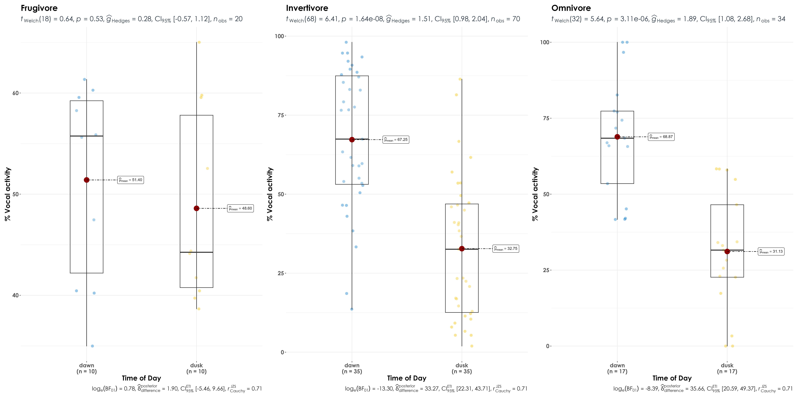
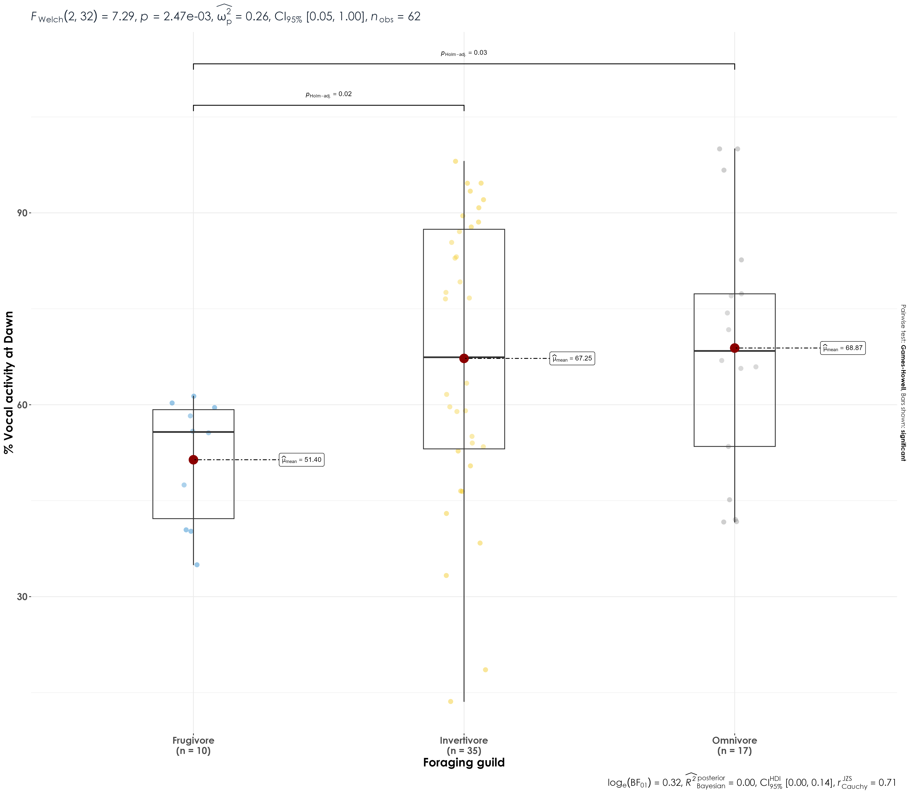

# Foraging guild  

Here, we ask if species of a certain foraging guild have higher vocal activity at dawn compared to dusk. Our null hypothesis/expectation is that there would be no differences in vocal activity across foraging guilds irrespective of time of day.  

## Install necessary libraries
```{r}
library(tidyverse)
library(dplyr)
library(stringr)
library(vegan)
library(ggplot2)
library(scico)
library(data.table)
library(extrafont)
library(ggstatsplot)
library(ggpubr)
library(ggrepel)
library(patchwork)
library(rstatix)
```

## Load acoustic data and species scientific names data
```{r}
acoustic_data <- read.csv("results/acoustic_data.csv")
species_codes <- read.csv("data/species-annotation-codes.csv")
trait <- read.csv("data/species-trait-dat.csv")
```

## Vocal activity data
```{r}
# sampling effort by time_of_day
effort <- acoustic_data %>%
    dplyr::select(site_id, date, time_of_day) %>%
    distinct() %>%
    arrange(time_of_day) %>%
    count(time_of_day) %>%
    rename(., nVisits = n)

# Above, we note that we had sampled ~293 site-date combinations at dawn, while ~245 site-date combinations were sampled at dusk

# total number of acoustic detections summarized across every 10-s audio file
# here, we estimate % detections at dawn and dusk, while accounting for sampling effort
vocal_act <- acoustic_data %>%
  group_by(time_of_day, eBird_codes) %>%
  summarise(detections = sum(number)) %>%
  left_join(., species_codes[,c(1,2,5)], 
                       by = "eBird_codes") %>%
   group_by(eBird_codes) %>%
  mutate(total_detections =sum(detections)) %>%
  mutate(percent_detections = (detections/total_detections)*100) %>%
  ungroup() 

## accouting for sampling effort and normalizing data
vocal_act <- vocal_act %>%
  left_join(., effort, by = "time_of_day") %>%
  mutate(normalized_detections = detections/nVisits) %>%
  group_by(eBird_codes) %>%
  mutate(total_normalized_detections = sum(normalized_detections)) %>%
  mutate(percent_normalized_detections = (normalized_detections/total_normalized_detections)*100) %>%
  ungroup() %>%

# in our case, we have 3 species which have 100% detections in dawn, Indian blackbird, Little spiderhunter and Purple sunbird. For these, we add a additional row specifying no detections in dusk.
  
  add_row(time_of_day= 'dusk', eBird_codes = 'pursun4', detections = 0, scientific_name = 'Cinnyris asiaticus', common_name = 'Purple Sunbird', total_detections = 315, percent_detections = 0, normalized_detections = 0,
          percent_normalized_detections = 0, nVisits = 245, total_normalized_detections = 1.075085) %>%
  add_row(time_of_day= 'dusk', eBird_codes = 'eurbla2', detections = 0, scientific_name = 'Turdus simillimus', common_name = 'Indian Blackbird', total_detections = 236, percent_detections = 0,normalized_detections = 0,
          percent_normalized_detections = 0, nVisits = 245,
          total_normalized_detections = 0.8054608) %>%
  add_row(time_of_day= 'dusk', eBird_codes = 'litspi1', detections = 0, scientific_name = 'Arachnothera longirostra', common_name = 'Little Spiderhunter', total_detections = 417, percent_detections = 0,
          normalized_detections = 0, nVisits = 245, 
          percent_normalized_detections = 0,
          total_normalized_detections = 1.423208)
```

## Join the vocal_activity data and species trait data
```{r}
vocal_act <- vocal_act %>% 
  left_join(trait[,c(1,2,29)], by = c('scientific_name',
                          'common_name')) 

## remove species that are poorly represented by a particular trophic niche
## we get rid of nectarivore species, aquatic predator and granivore
vocal_act <- vocal_act %>%
  filter(trophic_niche != "Aquatic predator") %>%
  filter(trophic_niche != "Granivore") %>%
  filter(trophic_niche != "Nectarivore") %>%
  filter(trophic_niche != "Vertivore")

## We retained 62 out of 69 species after the above filters
```

## Testing the differences among foraging guild categories using Wilcoxon test

Here, we see whether there are differences in the vocal activity between invertivores, frugivores, and omnivores in dawn and dusk individually.

```{r} 
stat.test <- vocal_act %>% 
  group_by (time_of_day) %>% 
  wilcox_test (percent_normalized_detections ~ trophic_niche)
```

Significant differences were observed between frugivore and omnivore species at dawn and dusk, as well as between frugivore and invertivore species.  

## Visualization of %detections across dawn and dusk within each foraging guild

Here, we ask if there is significantly higher dawn-biased vocal activity within each foraging guild, before comparing between guild types. 

```{r}
fig_forGuild_vocAct <- vocal_act %>%
  grouped_ggbetweenstats(x = time_of_day,
                         y = percent_normalized_detections,
                         xlab = "Time of Day",
                         ylab = "% Vocal activity", 
                         pairwise.display = "significant",
                         grouping.var = trophic_niche,
                         package = "ggsci",
                         palette = "default_jco",
                         violin.args = list(width = 0),
ggplot.component = list(theme(text = element_text(family = "Century Gothic", size = 15, face = "bold"),plot.title = element_text(family = "Century Gothic",
      size = 18, face = "bold"),
      plot.subtitle = element_text(family = "Century Gothic", 
      size = 15, face = "bold",color="#1b2838"),
      axis.title = element_text(family = "Century Gothic",
      size = 15, face = "bold")))) 

ggsave(fig_forGuild_vocAct, filename = "figs/fig_percentDetections_timeOfDay_foragingGuild.png", width = 24, height = 12, device = png(), units = "in", dpi = 300)
dev.off() 
```



## Comparing vocal activity at dawn between foraging guilds

```{r}
fig_between_foragingGuild_vocAct <- vocal_act %>%
  filter(time_of_day == "dawn") %>%
  ggbetweenstats(x = trophic_niche,
                         y = percent_normalized_detections,
                         xlab = "Foraging guild",
                         ylab = "% Vocal activity at Dawn", 
                         pairwise.display = "significant",
                         package = "ggsci",
                         palette = "default_jco",
                         violin.args = list(width = 0),
ggplot.component = list(theme(text = element_text(family = "Century Gothic", size = 15, face = "bold"),plot.title = element_text(family = "Century Gothic",
      size = 18, face = "bold"),
      plot.subtitle = element_text(family = "Century Gothic", 
      size = 15, face = "bold",color="#1b2838"),
      axis.title = element_text(family = "Century Gothic",
      size = 15, face = "bold")))) 

ggsave(fig_between_foragingGuild_vocAct, filename = "figs/fig_percentDetections_vs_foragingGuild.png", width = 16, height = 14, device = png(), units = "in", dpi = 300)
dev.off() 
```


## Figure for publication

```{r}
# Here, we will combine the above two figures created
library(patchwork)
fig_vocAct <- wrap_plots(fig_forGuild_vocAct, fig_between_foragingGuild_vocAct,
                         nrow = 2) +
              plot_annotation(
      tag_levels = "a",
      tag_prefix = "(",
      tag_suffix = ")")

ggsave(fig_vocAct, filename = "figs/fig04.png", width = 25, height = 19, device = png(), units = "in", dpi = 300)
dev.off() 
```


