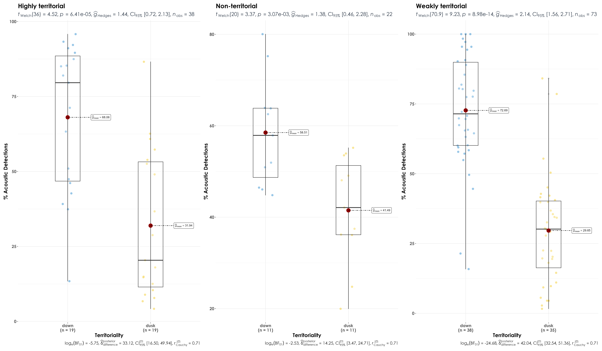

  
  
# Territoriality
  
In this script, we examine differences in vocal activity between dawn and dusk for each species in terms of their territoriality. The expectation is that highly territorial species would have a higher vocal activity, irrespective of dawn or dusk, than weakly and non-territorial species.

Highly territorial species are those which defend and maintain their territories throughout the year. Weakly territorial species are those which have broadly overlapping home ranges, or sometimes join mixed flocks without defined spatial ranges. Non-territorial species are those which do not defend territories, or defend very small areas around nest sites, or defend song or display posts only.

## Loading necessary libraries
```{r}
library(tidyverse)
library(dplyr)
library(stringr)
library(vegan)
library(ggplot2)
library(scico)
library(data.table)
library(extrafont)
library(ggstatsplot)
library(ggpubr)
library(ggrepel)
library(ggdist)
library(gghalves)     
library(rstatix)
```

## Loading territoriality data
```{r}
territoriality <- read.csv("data/territoriality-data.csv")

territoriality <- territoriality %>% dplyr::select (Species, Territory)
colnames (territoriality) <- c("scientific_name", "territory")

# Updating the scientific names of following species as per our dataset:
# Flame-throated bulbul- Rubigula gularis (earlier Pycnonotus gularis)
# Black eagle- Ictinaetus malaiensis (earlier Ictinaetus malayensis)
# Brown-capped pygmy woodpecker- Yungipicus nanus (earlier Dendrocopos nanus)
# Malabar barbet- Psilopogon malabaricus (earlier Megalaima malabarica)
# Dark-fronted babbler- Dumetia atriceps (earlier Rhopocichla atriceps)
# Greater flameback- Chrysocolaptes guttacristatus (earlier Chrysocolaptes lucidus)
# Indian blue robin- Larvivora brunnea (earlier Luscinia brunnea)
# Indian yellow tit- Machlolophus aplonotus (earlier Parus aplonotus)
# Jungle babbler- Argya striata (earlier Turdoides striata)
# Orange-headed thrush- Geokichla citrina (earlier Zoothera citrina)
# Rufous babbler- Argya subrufa (earlier Turdoides subrufa)
# Rufous woodpecker- Micropternus brachyurus (earlier Celeus brachyurus)
# Rusty-tailed flycatcher- Ficedula ruficauda (earlier Muscicapa ruficauda
# Spot-bellied eagle owl- Ketupa nipalensis (earlier Bubo nipalensis)
# Spotted dove- Spilopelia chinensis (earlier Stigmatopelia chinensis)
# Square-tailed bulbul- Hypsipetes ganeesa ganeesa (earlier Hypsipetes ganeesa)
# Thick-billed warbler- Arundinax aedon (earlier Acrocephalus aedon)
# White-bellied flycatcher- Cyornis pallidipes (earlier Cyornis pallipes)
# White-cheeked barbet- Psilopogon viridis (earlier Megalaima viridis)
# Wayanad laughingthrush- Pterorhinus delesserti (earlier Garrulax delesserti)
# Yellow-browed bulbul- Iole indica (earlier Acritillas indica)

territoriality <- territoriality %>% mutate(scientific_name = recode (scientific_name, 'Pycnonotus gularis' = 'Rubigula gularis', 'Ictinaetus malayensis' = 'Ictinaetus malaiensis', 'Dendrocopos nanus' = 'Yungipicus nanus', 'Megalaima malabarica' = 'Psilopogon malabaricus', 'Rhopocichla atriceps' = 'Dumetia atriceps', 'Chrysocolaptes lucidus' = 'Chrysocolaptes guttacristatus', 'Luscinia brunnea' = 'Larvivora brunnea', 'Parus aplonotus' = 'Machlolophus aplonotus', 'Turdoides striata' = 'Argya striata', 'Zoothera citrina' = 'Geokichla citrina', 'Turdoides subrufa' = 'Argya subrufa', 'Celeus brachyurus' = 'Micropternus brachyurus', 'Muscicapa ruficauda' = 'Ficedula ruficauda', 'Bubo nipalensis' = 'Ketupa nipalensis', 'Stigmatopelia chinensis' = 'Spilopelia chinensis', 'Hypsipetes ganeesa' = 'Hypsipetes ganeesa ganeesa', 'Acrocephalus aedon' = 'Arundinax aedon', 'Cyornis pallipes' = 'Cyornis pallidipes', 'Megalaima viridis' = 'Psilopogon viridis', 'Garrulax delesserti' = 'Pterorhinus delesserti', 'Acritillas indica' = 'Iole indica' ))
```

## Load acoustic data and species scientific names data
```{r}
acoustic_data <- read.csv("results/acoustic_data.csv")
species_codes <- read.csv("data/species-annotation-codes.csv")
```

## Vocal activity data
```{r}
# total number of acoustic detections summarized across every 10-s audio file
vocal_act <- acoustic_data %>%
  group_by(time_of_day, eBird_codes) %>%
  summarise(detections = sum(number)) %>%
  left_join(., species_codes[,c(1,2,5)], 
                       by = "eBird_codes") %>%
   group_by(eBird_codes) %>%
  mutate(total_detections =sum(detections)) %>%
  mutate(percent_detections = (detections/total_detections)*100) %>%
  ungroup()
```

## Join the vocal_activity data and territoriality data
```{r}
vocal_act <- vocal_act %>% 
  left_join(territoriality, by = 'scientific_name') %>%
  dplyr::mutate(territory_cat = case_when (territory %in% '3' ~'Highly territorial', territory %in% '2' ~ 'Weakly territorial', territory %in% '1' ~'Non-territorial'))
```

## Visualization of % detections vs. territoriality
```{r}
## between dawn and dusk
fig_terr_vocAct <- vocal_act %>%
  grouped_ggbetweenstats(x = time_of_day,
                         y = percent_detections,
                         grouping.var = territory_cat,
                         xlab = "Territoriality",
                         ylab = "% Acoustic Detections", 
                         pairwise.display = "significant",
                         package = "ggsci",
                         palette = "default_jco",
                         violin.args = list(width = 0),
ggplot.component = list(theme(text = element_text(family = "Century Gothic", size = 15, face = "bold"),plot.title = element_text(family = "Century Gothic",
      size = 18, face = "bold"),
      plot.subtitle = element_text(family = "Century Gothic", 
      size = 15, face = "bold",color="#1b2838"),
      axis.title = element_text(family = "Century Gothic",
      size = 15, face = "bold")))) 

ggsave(fig_terr_vocAct, filename = "figs/fig_percentDetections_territoriality.png", width = 24, height = 14, device = png(), units = "in", dpi = 300)
dev.off() 
```

 
