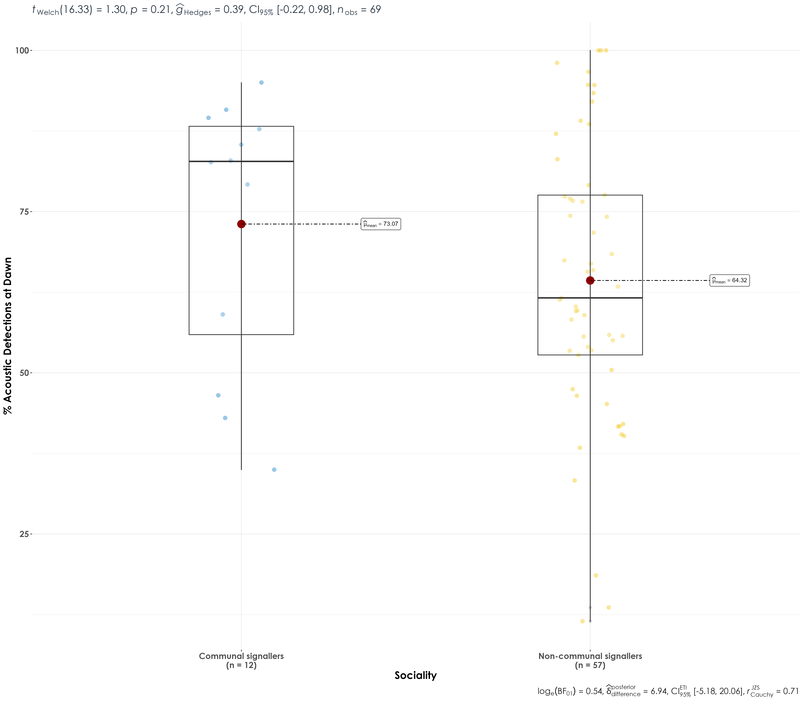
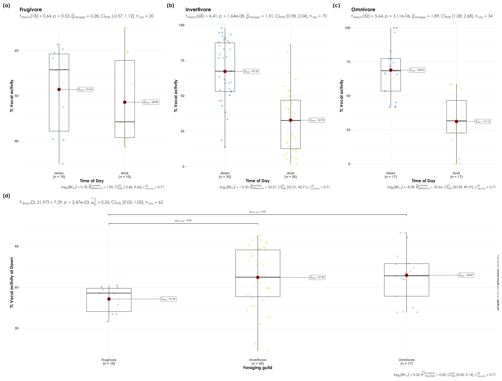

 
  
# Sociality
  
In this script, we examine the role of sociality in vocal activity between dawn and dusk. The expectation is that communal and non-communal signalling species have higher vocal activity in dawn than dusk.

Communal signallers are species that produce long-range acoustic signals in groups, either duets (two individuals) or choruses (three or more individuals) by both males and females. Non-communal signallers are species that sing as single individuals and not communally.

## Loading necessary libraries
```{r}
library(tidyverse)
library(dplyr)
library(stringr)
library(vegan)
library(ggplot2)
library(scico)
library(data.table)
library(extrafont)
library(purrr)
library(ggstatsplot)
library(ggpubr)
library(ggrepel)
library(ggdist)
library(gghalves)     
library(rstatix)
```

## Loading sociality data
```{r}
sociality <- read.csv("data/sociality-data.csv")

sociality <- sociality %>% dplyr::select (Species, Communal)
colnames (sociality) <- c("scientific_name", "sociality")

# Updating the scientific names of following species as per our dataset:
# Flame-throated bulbul- Rubigula gularis (earlier Pycnonotus gularis)
# Black eagle- Ictinaetus malaiensis (earlier Ictinaetus malayensis)
# Brown-capped pygmy woodpecker- Yungipicus nanus (earlier Dendrocopos nanus)
# Malabar barbet- Psilopogon malabaricus (earlier Megalaima malabarica)
# Dark-fronted babbler- Dumetia atriceps (earlier Rhopocichla atriceps)
# Greater flameback- Chrysocolaptes guttacristatus (earlier Chrysocolaptes lucidus)
# Indian blue robin- Larvivora brunnea (earlier Luscinia brunnea)
# Indian yellow tit- Machlolophus aplonotus (earlier Parus aplonotus)
# Jungle babbler- Argya striata (earlier Turdoides striata)
# Orange-headed thrush- Geokichla citrina (earlier Zoothera citrina)
# Rufous babbler- Argya subrufa (earlier Turdoides subrufa)
# Rufous woodpecker- Micropternus brachyurus (earlier Celeus brachyurus)
# Rusty-tailed flycatcher- Ficedula ruficauda (earlier Muscicapa ruficauda
# Spot-bellied eagle owl- Ketupa nipalensis (earlier Bubo nipalensis)
# Spotted dove- Spilopelia chinensis (earlier Stigmatopelia chinensis)
# Thick-billed warbler- Arundinax aedon (earlier Acrocephalus aedon)
# White-bellied flycatcher- Cyornis pallidipes (earlier Cyornis pallipes)
# White-cheeked barbet- Psilopogon viridis (earlier Megalaima viridis)
# Wayanad laughingthrush- Pterorhinus delesserti (earlier Garrulax delesserti)
# Yellow-browed bulbul- Iole indica (earlier Acritillas indica)

sociality <- sociality %>% mutate(scientific_name = recode (scientific_name, 'Pycnonotus gularis' = 'Rubigula gularis', 'Ictinaetus malayensis' = 'Ictinaetus malaiensis', 'Dendrocopos nanus' = 'Yungipicus nanus', 'Megalaima malabarica' = 'Psilopogon malabaricus', 'Rhopocichla atriceps' = 'Dumetia atriceps', 'Chrysocolaptes lucidus' = 'Chrysocolaptes guttacristatus', 'Luscinia brunnea' = 'Larvivora brunnea', 'Parus aplonotus' = 'Machlolophus aplonotus', 'Turdoides striata' = 'Argya striata', 'Zoothera citrina' = 'Geokichla citrina', 'Turdoides subrufa' = 'Argya subrufa', 'Celeus brachyurus' = 'Micropternus brachyurus', 'Muscicapa ruficauda' = 'Ficedula ruficauda', 'Bubo nipalensis' = 'Ketupa nipalensis', 'Stigmatopelia chinensis' = 'Spilopelia chinensis','Acrocephalus aedon' = 'Arundinax aedon', 'Cyornis pallipes' = 'Cyornis pallidipes', 'Megalaima viridis' = 'Psilopogon viridis', 'Garrulax delesserti' = 'Pterorhinus delesserti', 'Acritillas indica' = 'Iole indica' ))
```

## Load acoustic data and species scientific names data
```{r}
acoustic_data <- read.csv("results/acoustic_data.csv")
species_codes <- read.csv("data/species-annotation-codes.csv")
```

## Vocal activity data
```{r}
# sampling effort by time_of_day
effort <- acoustic_data %>%
    dplyr::select(site_id, date, time_of_day) %>%
    distinct() %>%
    arrange(time_of_day) %>%
    count(time_of_day) %>%
    rename(., nVisits = n)

# Above, we note that we had sampled ~293 site-date combinations at dawn, while ~245 site-date combinations were sampled at dusk

# total number of acoustic detections summarized across every 10-s audio file
# here, we estimate % detections at dawn and dusk, while accounting for sampling effort
vocal_act <- acoustic_data %>%
  group_by(time_of_day, eBird_codes) %>%
  summarise(detections = sum(number)) %>%
  left_join(., species_codes[,c(1,2,5)], 
                       by = "eBird_codes") %>%
   group_by(eBird_codes) %>%
  mutate(total_detections =sum(detections)) %>%
  mutate(percent_detections = (detections/total_detections)*100) %>%
  ungroup() 

## accouting for sampling effort and normalizing data
vocal_act <- vocal_act %>%
  left_join(., effort, by = "time_of_day") %>%
  mutate(normalized_detections = detections/nVisits) %>%
  group_by(eBird_codes) %>%
  mutate(total_normalized_detections = sum(normalized_detections)) %>%
  mutate(percent_normalized_detections = (normalized_detections/total_normalized_detections)*100) %>%
  ungroup() %>%

# in our case, we have 3 species which have 100% detections in dawn, Indian blackbird, Little spiderhunter and Purple sunbird. For these, we add a additional row specifying no detections in dusk.
  
  add_row(time_of_day= 'dusk', eBird_codes = 'pursun4', detections = 0, scientific_name = 'Cinnyris asiaticus', common_name = 'Purple Sunbird', total_detections = 315, percent_detections = 0, normalized_detections = 0,
          percent_normalized_detections = 0, nVisits = 245, total_normalized_detections = 1.075085) %>%
  add_row(time_of_day= 'dusk', eBird_codes = 'eurbla2', detections = 0, scientific_name = 'Turdus simillimus', common_name = 'Indian Blackbird', total_detections = 236, percent_detections = 0,normalized_detections = 0,
          percent_normalized_detections = 0, nVisits = 245,
          total_normalized_detections = 0.8054608) %>%
  add_row(time_of_day= 'dusk', eBird_codes = 'litspi1', detections = 0, scientific_name = 'Arachnothera longirostra', common_name = 'Little Spiderhunter', total_detections = 417, percent_detections = 0,
          normalized_detections = 0, nVisits = 245, 
          percent_normalized_detections = 0,
          total_normalized_detections = 1.423208)
```

## Join the vocal_activity data and sociality data
```{r}
vocal_act <- vocal_act %>% 
  left_join(sociality, by = 'scientific_name') %>%
  dplyr::mutate(sociality_cat = case_when (sociality %in% '0' ~ 'Non-communal signallers', sociality %in% '1' ~ 'Communal signallers'))
```

## Testing the differences between socialiaty categories using Wilcoxon test

Here, we see whether there are differences in the vocal activity between communal and non-communal signallers in dawn and dusk individually. 

```{r} 
stat.test <- vocal_act %>% 
  group_by (time_of_day) %>% 
  wilcox_test (percent_normalized_detections ~ sociality_cat)
```

No significant differences were observed in vocal activity between communal signallers and non-communal signallers at dawn or dusk. 

## Visualization of % detections vs. sociality
```{r}
## between dawn and dusk
fig_soc_vocAct <- vocal_act %>%
  filter(time_of_day == "dawn") %>%
  ggbetweenstats(x = sociality_cat,
                         y = percent_normalized_detections,
                         xlab = "Levels of sociality",
                         ylab = "", 
                         pairwise.display = "significant",
                         package = "ggsci",
                         palette = "default_jco",
                         violin.args = list(width = 0),
ggplot.component = list(theme(text = element_text(family = "Century Gothic", size = 15, face = "bold"),plot.title = element_text(family = "Century Gothic",
      size = 18, face = "bold"),
      plot.subtitle = element_text(family = "Century Gothic", 
      size = 15, face = "bold",color="#1b2838"),
      axis.title = element_text(family = "Century Gothic",
      size = 15, face = "bold")))) 

ggsave(fig_soc_vocAct, filename = "figs/fig_percentDetections_vs_sociality.png", width = 16, height = 14, device = png(), units = "in", dpi = 300)
dev.off() 
```


## Figure for publication
```{r}
library(patchwork)

# We will combine the territoriality and communal signalling figure into a side-by-side panel
# Assumption here that the territoriality figure is already loaded in the R environment (if not; please run the previous script for the same)

fig_terr_soc  <- wrap_plots(fig_terr_vocAct, fig_soc_vocAct,
                         ncol = 2) +
              plot_annotation(
      tag_levels = "a",
      tag_prefix = "(",
      tag_suffix = ")")

ggsave(fig_terr_soc, filename = "figs/fig04.png", width = 16, height = 14, device = png(), units = "in", dpi = 300)
dev.off() 
```


