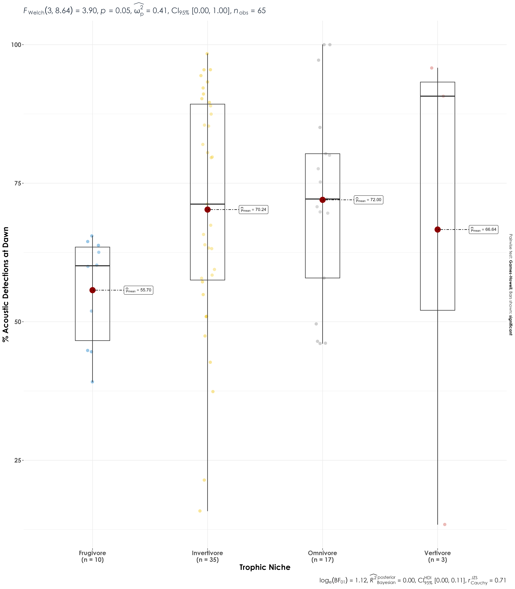

# Trophic niche  

Here, we ask if species of a certain foraging guild have higher vocal activity at dawn compared to dusk. Our null hypothesis/expectation is that there would be no differences in vocal activity across foraging guilds irrespective of time of day.  

## Install necessary libraries
```{r}
library(tidyverse)
library(dplyr)
library(stringr)
library(vegan)
library(ggplot2)
library(scico)
library(data.table)
library(extrafont)
library(ggstatsplot)
library(ggpubr)
library(ggrepel)
library(patchwork)
library(rstatix)
```

## Load acoustic data and species scientific names data
```{r}
acoustic_data <- read.csv("results/acoustic_data.csv")
species_codes <- read.csv("data/species-annotation-codes.csv")
trait <- read.csv("data/species-trait-dat.csv")
```

## Vocal activity data
```{r}
# total number of acoustic detections summarized across every 10-s audio file
vocal_act <- acoustic_data %>%
  group_by(time_of_day, eBird_codes) %>%
  summarise(detections = sum(number)) %>%
  left_join(., species_codes[,c(1,2,5)], 
                       by = "eBird_codes") %>%
   group_by(eBird_codes) %>%
  mutate(total_detections =sum(detections)) %>%
  mutate(percent_detections = (detections/total_detections)*100) %>%
  ungroup()
```

## Join the vocal_activity data and species trait data
```{r}
vocal_act <- vocal_act %>% 
  left_join(trait[,c(1,2,29)], by = c('scientific_name',
                          'common_name')) 

## remove species that are poorly represented by a particular trophic niche
## we get rid of nectarivore species, aquatic predator and granivore
vocal_act <- vocal_act %>%
  filter(trophic_niche != "Aquatic predator") %>%
  filter(trophic_niche != "Granivore") %>%
  filter(trophic_niche != "Nectarivore")

## We retained 65 out of 69 species after the above filters
```


## Visualization of % detections vs. trophic niche
```{r}
fig_trophicNiche_vocAct <- vocal_act %>%
  grouped_ggbetweenstats(x = time_of_day,
                         y = percent_detections,
                         grouping.var = trophic_niche,
                         xlab = "Trophic Niche",
                         ylab = "% Acoustic Detections", 
                         pairwise.display = "significant",
                         package = "ggsci",
                         palette = "default_jco",
                         violin.args = list(width = 0),
ggplot.component = list(theme(text = element_text(family = "Century Gothic", size = 15, face = "bold"),plot.title = element_text(family = "Century Gothic",
      size = 18, face = "bold"),
      plot.subtitle = element_text(family = "Century Gothic", 
      size = 15, face = "bold",color="#1b2838"),
      axis.title = element_text(family = "Century Gothic",
      size = 15, face = "bold")))) 

ggsave(fig_trophicNiche_vocAct, filename = "figs/fig_percentDetections_trophicNiche.png", width = 18, height = 14, device = png(), units = "in", dpi = 300)
dev.off() 
```

We observe significant differences in vocal activity for frugivorous, invertivorous and omnivorous species between dawn and dusk, where much higher acoustic detections or calling was observed/detected at dawn compared to dusk. 

 
