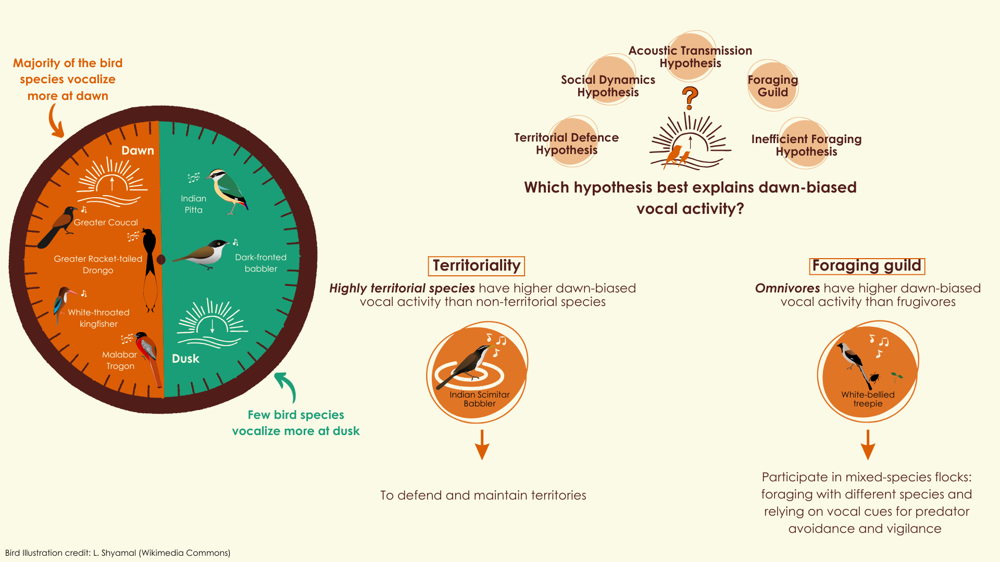

## *Drivers of diurnal variation in vocal activity in a tropical bird community*

<!-- badges: start -->

 <!-- badges: end -->

This repository contains code and analysis for a manuscript that examines the drivers of diurnal variation in vocal activity for a tropical bird community in the Western Ghats.

This manuscript is currently in *review*. Please reach out to the repository owner if you have questions.

### [Readable version](https://vjjan91.github.io/diurnal-Acoustics/)

A readable version of this analysis is available in bookdown format by clicking on the heading above.

### Source code for the analyses

We describe what each script (`.Rmd`) of this repository is intended to achieve below.

-   *01_data-cleaning.Rmd:*. This script is intended to clean data and ensure that the appropriate columns are available for further analyses and calculations. specifically, we combine data from dawn and dusk into a single object/.csv for independent use. To access the output from this script, head over to `results/acoustic-data.csv`.

-   *02_vocal-activity.Rmd:*. Here, we calculate differences in vocal activity between dawn and dusk for the entire community and for each species, separately.

-   *03_frequency.Rmd*: Here, we test the predictions of the acoustic transmission hypothesis by testing associations between the median peak frequency (at which a species vocalizes) and the number of acoustic detections at dawn and dusk.

-   *04_light-availability.Rmd*: Here, we test the predictions of the Inefficient foraging hypothesis by examining how vocal activity varies as a function of `time_to_darkness` - a proxy measure for total daytime light levels.

-   *05_foraging-guild.Rmd*: Here we examine if vocal activity significantly differs across foraging guild categories (frugivore/omnivore/invertivore).

-   *06_territoriality.Rmd*: Here, we examine if vocal activity significantly differs across categories of territoriality (highly territorial/weakly territorial/non-territorial).

-   *07_sociality.Rmd*: Here, we examine if vocal activity significantly differes across levels of communal signaling (communal/non-communal signalers).

-   *08_pgls-analysis.Rmd:* Here, we test which environmental or social factor/combination of factors best explains dawn-biased vocal activity.

### Data

The `data/` folder contains the following datasets required to reproduce the above scripts.

-   `birdtree.nex`: This file contains the list of phylogenetic trees required for the PGLS analysis (accessed from <https://birdtree.org>).

-   `frequency-data.csv`: This file contains high-quality vocalizations for 114 species of birds and associated measurements.

-   `list-of-sites.csv`: Contains the list of sites across which audio recorders were deployed along with ancillary information, including latitude, longitude.

-   `sociality-data.csv`: Contains information on whether a species is a communal signaller or a non-communal signaller (accessed from [Tobias et al. 2016](https://www.frontiersin.org/journals/ecology-and-evolution/articles/10.3389/fevo.2016.00074/full)).

-   `species-annotation-codes.csv`: Contains list of species common, scientific names and eBird species codes for standardization.

-   `species-trait-dat.csv`: Contains information on foraging guild type for each species, accessed from the [State of India's Birds Report (2023)](https://stateofindiasbirds.in/) and [AVONET trait database (Tobias et al. 2022)](https://onlinelibrary.wiley.com/doi/full/10.1111/ele.13898).

-   `territoriality-data.csv`: Contains information on whether a species is highly territorial, weakly territorial or non-territorial (accessed from [Tobias et al. 2016](https://www.frontiersin.org/journals/ecology-and-evolution/articles/10.3389/fevo.2016.00074/full)).

### Results

This folder contains outputs that were obtained by running the above scripts.

-   `acoustic-data.csv`: This file contains the output from `01_data-cleaning.Rmd` and includes the data required to run all the analysis associated with this study.

-   `metadata-detections-lightAvailability-correlations.csv`: This file contains the metadata from running a Pearson's correlation test between the number of acoustic detections and time to darkness for all species for dawn and dusk, separately.

### Figures

The `figs\` folder contains figures accompanying the main text, as well as supplementary material figures.

### Attribution

To cite this repository:

Ramesh, Vijay and Sundar, Pavithra. (2023). Source code and supplementary material for <edit information here>(version xx). Zenodo. [doi to be added].
